# Decouvrir-docker
Partez à la découverte de Docker, une solution de virtualisation permettant de faire tourner des applications dans des conteneurs indépendants. 

## Résumé du cours
Partez à la découverte de Docker, une solution de virtualisation permettant de faire tourner des applications dans des conteneurs indépendants. Dans cette formation pour administrateurs et chefs de projet, Samir Lakhdari vous fait découvrir les principes et le fonctionnement de Docker. Vous apprendrez à exécuter des conteneurs à partir d'images d'applications et vous verrez également comment créer vos propres images. Vous aborderez aussi le stockage de données dans des volumes persistants, la communication entre conteneurs, le réseau, la distribution d'images et, bien entendu, la sauvegarde. À la fin de cette formation, vous serez capable d'exécuter des conteneurs Docker avec des applications tierces ou avec vos propres applications.

# Machine Virtuelle VS Docker
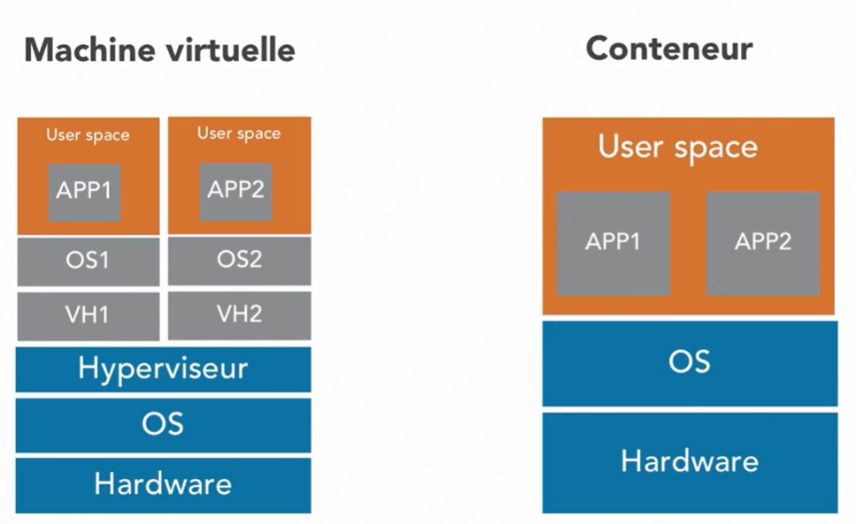

## Architecture Docker
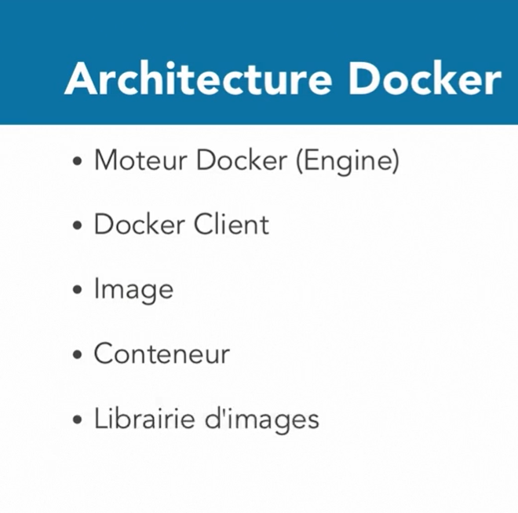

### Moteur Docker (Engine)
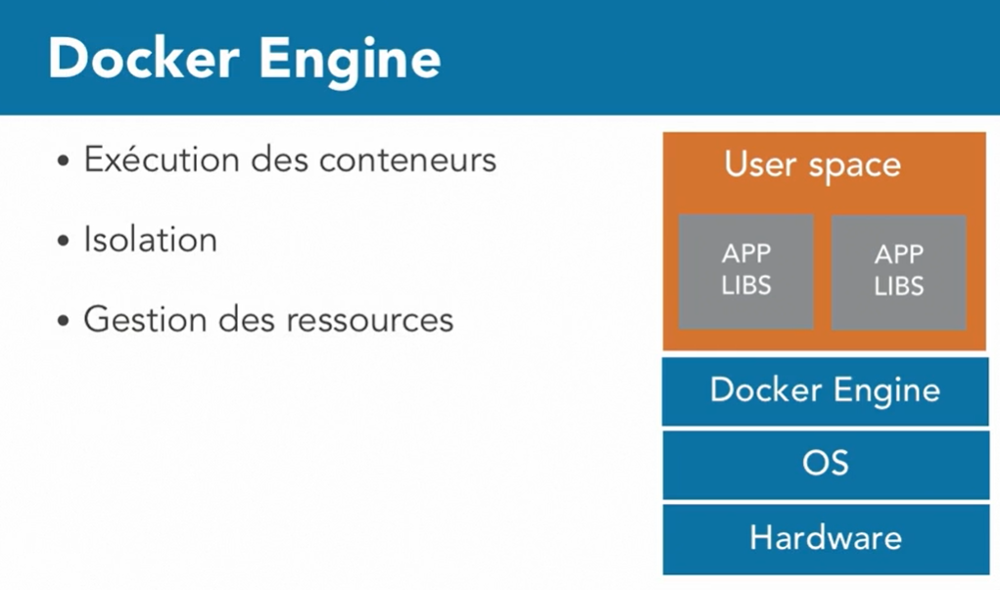
### Docker Client
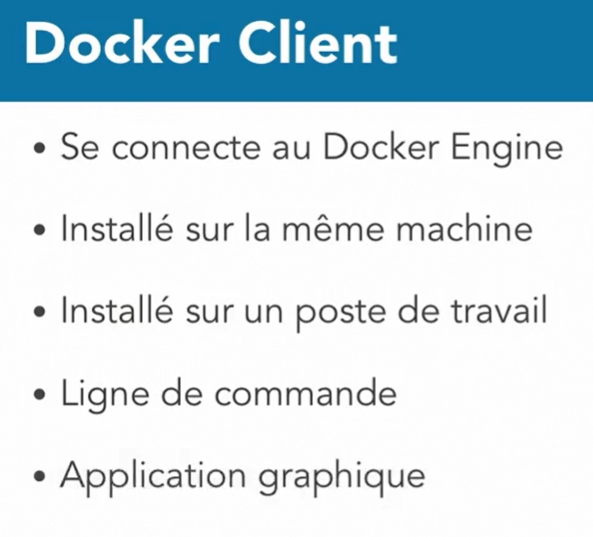
### Docker Image
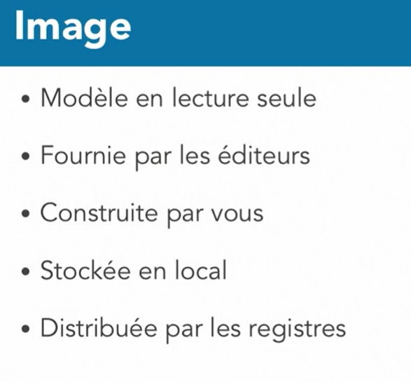
### Docker Conteneur
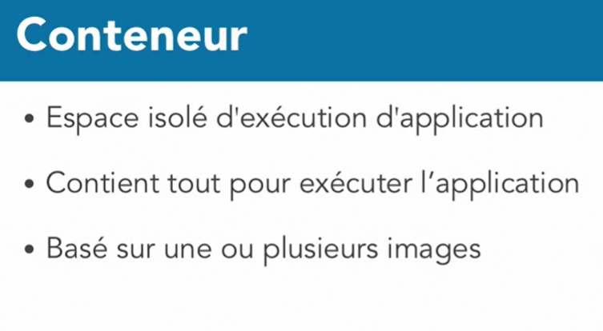
### Docker Registre (Librairie d'images)

## Appréhender le fonctionnement de Docker
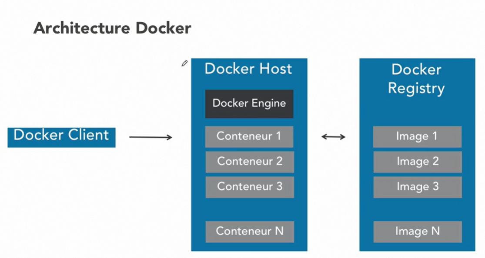

## Installer Docker
Après avoir decouvrir Docker, nous allons l'installer selon notre plateforme à travers ce lien ci-dessous:   [Installer Docker](https://docs.docker.com/engine/install/)

## Quelques commande docker
<code>
    <pre>
        docker search nomImage # Pour chercher une image
        docker pull nomImage # pour telechager une image
        docker images # pour voir la liste des image en local
        docker rmi -f nomImage # pour supprimer une image
        docker rm -f $(docker ps -a -q) # pour supprimer également une image
    </pre>
</code>

## Explorer Docker Hub
Vous pouvez également explorer docker hub pour chercher des images et télécharger en local pour vos utilisations personnelles à travers ce lien ci-dessous:   [Docker Hub](https://hub.docker.com)
## Appréhender la Docker
* pour afficher le manuel de la commande docker, on utilise l'option **--help**: <code>docker --help | more</code>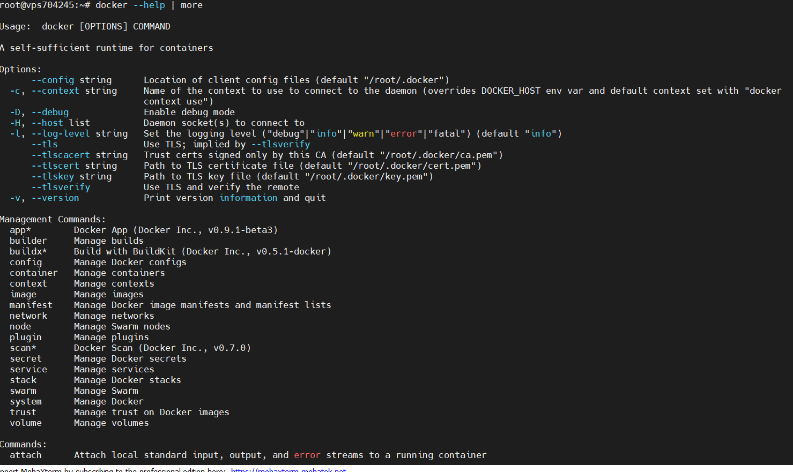
* pour afficher l'aide une commande de context on utilise également l'option **--help**: <code>docker container --help | more</code>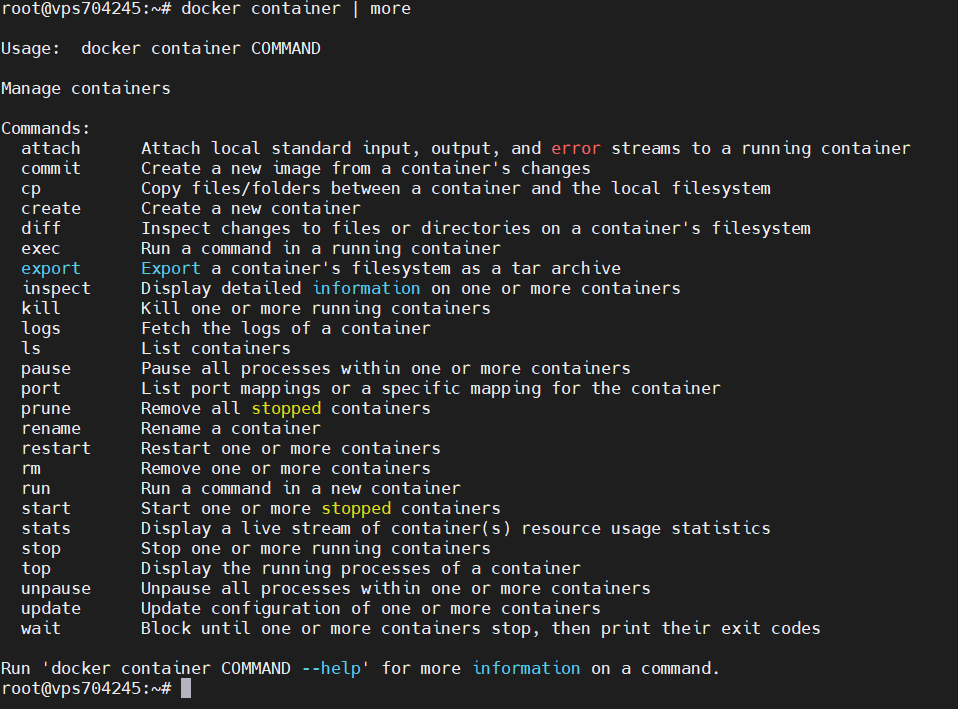

## Le Cycle de vie d'un conteneur docker
### Le Cycle de vie de base d'un conteneur docker
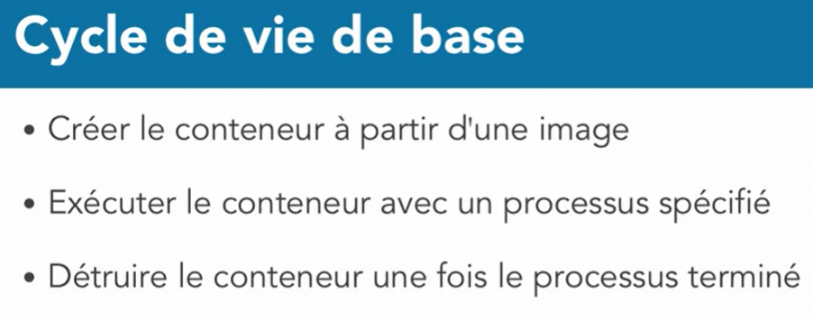
### Le Cycle de vie de avancé d'un conteneur docker
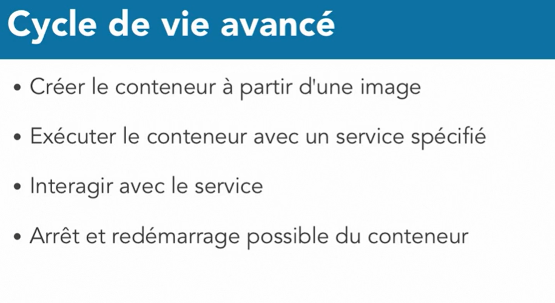