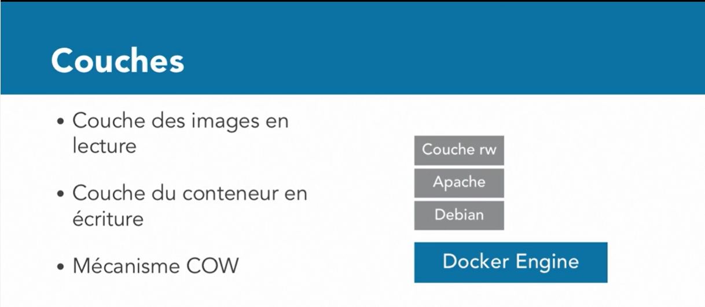
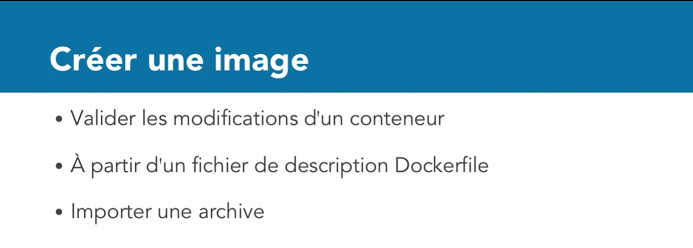

# Decouvrir-docker
Partez à la découverte de Docker, une solution de virtualisation permettant de faire tourner des applications dans des conteneurs indépendants. 

## Résumé du cours
Partez à la découverte de Docker, une solution de virtualisation permettant de faire tourner des applications dans des conteneurs indépendants. Dans cette formation pour administrateurs et chefs de projet, Samir Lakhdari vous fait découvrir les principes et le fonctionnement de Docker. Vous apprendrez à exécuter des conteneurs à partir d'images d'applications et vous verrez également comment créer vos propres images. Vous aborderez aussi le stockage de données dans des volumes persistants, la communication entre conteneurs, le réseau, la distribution d'images et, bien entendu, la sauvegarde. À la fin de cette formation, vous serez capable d'exécuter des conteneurs Docker avec des applications tierces ou avec vos propres applications.

# Machine Virtuelle VS Docker

## Architecture Docker

### Moteur Docker (Engine)

### Docker Client

### Docker Image

### Docker Conteneur

### Docker Registre (Librairie d'images)

## Appréhender le fonctionnement de Docker

## Installer Docker
Après avoir decouvrir Docker, nous allons l'installer selon notre plateforme à travers ce lien ci-dessous:   [Installer Docker](https://docs.docker.com/engine/install/)

## Quelques commande docker
<code>
    <pre>
        docker search nomImage # Pour chercher une image
        docker pull nomImage # pour telechager une image
        docker images # pour voir la liste des image en local
        docker rmi -f nomImage # pour supprimer une image
        docker rm -f $(docker ps -a -q) # pour supprimer également une image
    </pre>
</code>

## Explorer Docker Hub
Vous pouvez également explorer docker hub pour chercher des images et télécharger en local pour vos utilisations personnelles à travers ce lien ci-dessous:   [Docker Hub](https://hub.docker.com)
## Appréhender la Docker
* pour afficher le manuel de la commande docker, on utilise l'option **--help**: <code>docker --help | more</code>
* pour afficher l'aide une commande de context on utilise également l'option **--help**: <code>docker container --help | more</code>

## Le Cycle de vie d'un conteneur docker
### Le Cycle de vie de base d'un conteneur docker

### Le Cycle de vie de avancé d'un conteneur docker

## Exécuter un conteneur docker
* <code>docker run nomImage</code>
* <code>docker run -ti nomImage</code> pour l'exécuter en mode interactif
* <code> docker ps -a</code> pour afficher les conteneurs la lancé
* [Ressource pour configurer mongodb sur mon VPS](https://www.bmc.com/blogs/mongodb-docker-container/)
  
## Exécution en mode attaché et detaché
* <code>docker run --name=mongodb --hostnamehost01 -it mong</code>
* pour verifier le nom <code>hostname</code>
* pour arrêter un conteneur <code>exit</code>
* mode d'exécution en arrière plan on ajoute l'option **-d** ou **--detach** ex:  <code>docker run -d -it mongo</code>
* on peut aussi balancer d'un mode en un autre avec les combinaisions suivantes:   
* on peut vérifier les log d'un conteneur en arrière plan <code>docker logs nomImage</code>
  
## Inspecter un conteneur
* on va lancer d'abord un conteneur pour pouvoir effectuer des des inspections. 
<code>docker run -d -P --name=web03 --hostname=cont03 nginx</code>
* primièrement nous allons lancer la commande <code>docker inspect web03</code> 
  
* on peut également extraire une partie ou un attribut d'un champs avec la commande suivante:  
  <code>docker inspect --format='{{.state.Status}} web03</code>
  

* autre par exemple: 
  <code>docker inspect --format='{{.NetworkSettings.IPAddres}}' web03</code>
  

* une dernière possibilité est:  
  <code>docker inspect --format='{{json .State}}' web03</code>
  

## Comment lister les conteneur docker
* pour lister les conteneurs lancés 
    <code>docker ps</code>
     
* pour lister tous les conteneurs même ceux qui sont arrêtes 
  <code>docker ps -a</code>
  
* pour voir les n derniers conteneurs 
  <code>docker ps --last 2</code>
  

* afficher uniquement les ID des conteneurs 
  <code>docker ps -q</code>
  
* les options de filtrage 
  <code>docker ps -a --filter name=web</code> 
  
<code>docker ps -a --filter status=exited</code> 
  
* lorsqu'on essaye d'arrêter un conteneur en cours d'exécution on obtient une erreur 
* <code>docker rm web03</code>
  
* pour remedier à ce problème, on exécute cette commande 
  <code>docker rm -f web03</code>
  
* pour supprimer tous les conteneurs arrêtés 
  <code>docker rm $(docker ps -aq --filter status=exited)</code>
  
## Comprendre une image docker
### C'est quoi une couche docker ?

### Qu'est ce qu'une image docker 
Une image est constituée de un plusieurs couche docker
#### Comment créer une image

#### Espace de nommage

## Comment créer une image à partir d'un conteneur docker
* <code>docker run -it --name=mycentos centos</code>
* parfaut la commande <code>wget</code> n'existe pas sur centos
  
* on va installer **wget** dans centos
* <code>yum install wget</code>
  
* on va tester **wget** <code>wget</code>, puis on l'arrêter et enfin nous allons tester <code>docker ps -a</code>
  
* on peut visualiser les différences
  <code>docker diff mycentos</code>
  
  > pour dire que dans le dossier **/bin** nous avons installer **wget** 
  > A sigifie **Ajout**  
  > C sigifie **Change**  
  > D signifie **Delete**

### Comment enrégister sur notre depôt
<code>docker commit mycentos ldamaro98/mycentos:1.0</code>
## Générer des volumes docker
* Volumes nommés 
  <code>docker volume create --name=vol1</code>
* Pour afficher la liste des volumes docker 
  <code>docker volume ls</code>
* Pour monter un volume 
   <code>docker run -it -v vol1:/www/html mycentos</code>
* Pour inspeter le volume 
  <code>docker volume inspect vol1</code>
* Pour supprimer un volume 
  <code>docker volume rm -f vol1</code>
* Pour créer un anonyme, on le crée lors de lancement d'un conteneur 
  <code>docker run -v /var/www/html mycentos</code>
* Pour supprimer un volume anonyme, lors de la suppression d'une image 
  <code>docker rm -v idImage</code>
## Aborder les volumes d'hôte
* nous allons d'abord lancer un serveur **nginx** 
  <code>docker run -d --name=nginx nginx</code>
* Pour se connecter à un conteneur docker 
  <code>docker exec -it nginx</code>
* Pour afficher le contenu du ficher de configuration 
  <code>cat /etc/nginx/nginx.conf</code>
  
* Pour quitter(se deconnecter de **nginx**) 
  <code>exit</code>
* Pour arrêter le conteneur 
  <code>docker stop nginx </code>
* Pour récupérer un du conteneur vers un fichier local 
  <code>mkdir nginxconf && cd nginxconf</code> 
  <code>docker cp nginx:/etc/nginx/nginx.conf .</code>
  
* Pour monter le fichier dans notre conteneur 
  <code>docker run -d --name=nginx2 -v /home/user1/nginx/nginx.conf:/etc/nginx/nginx.conf</code>
* Se connecter au connecter et vérifier  
  <code>docker exec -it nginx2 bash</code> 
  <code>cat /etc/nginx/nginx.conf</code>
  

## Découvrir le modèle réseau
